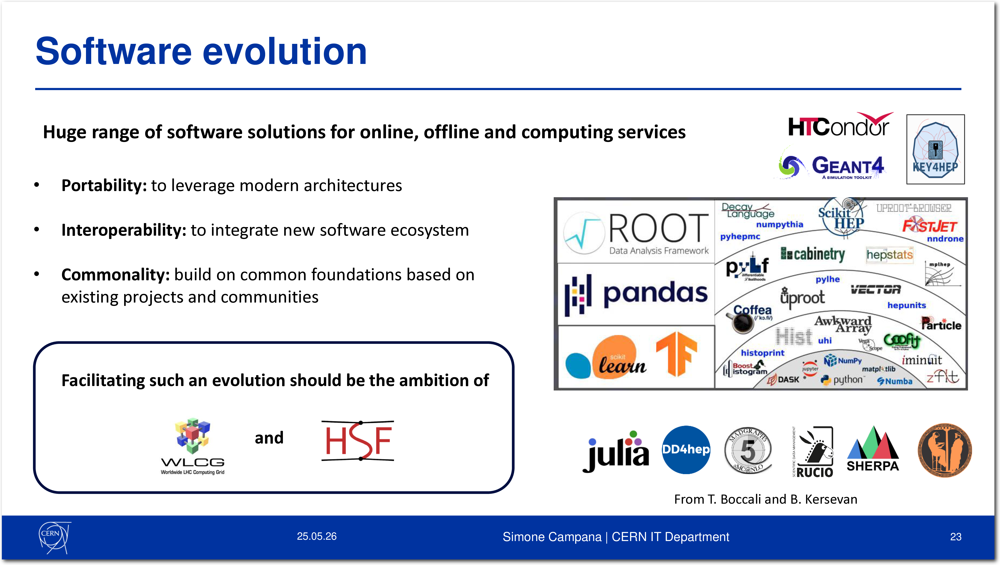
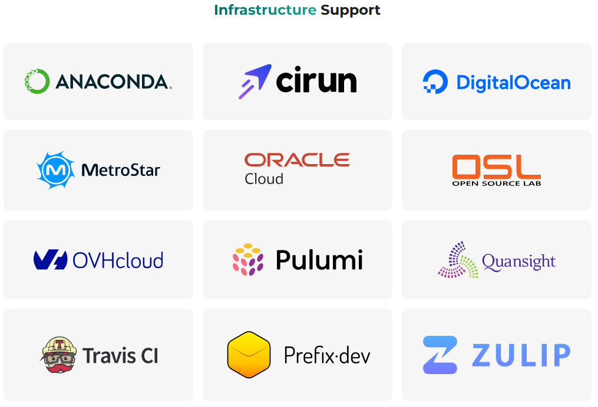
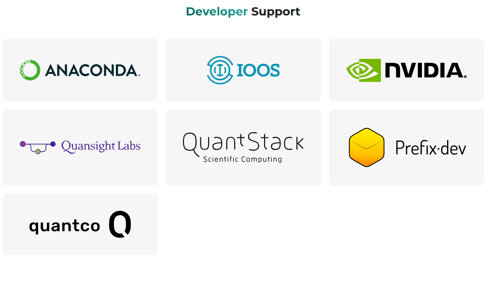
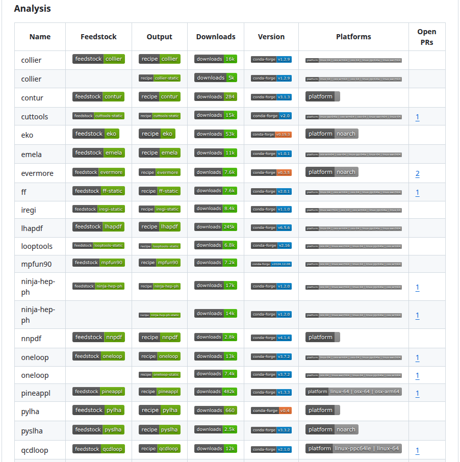
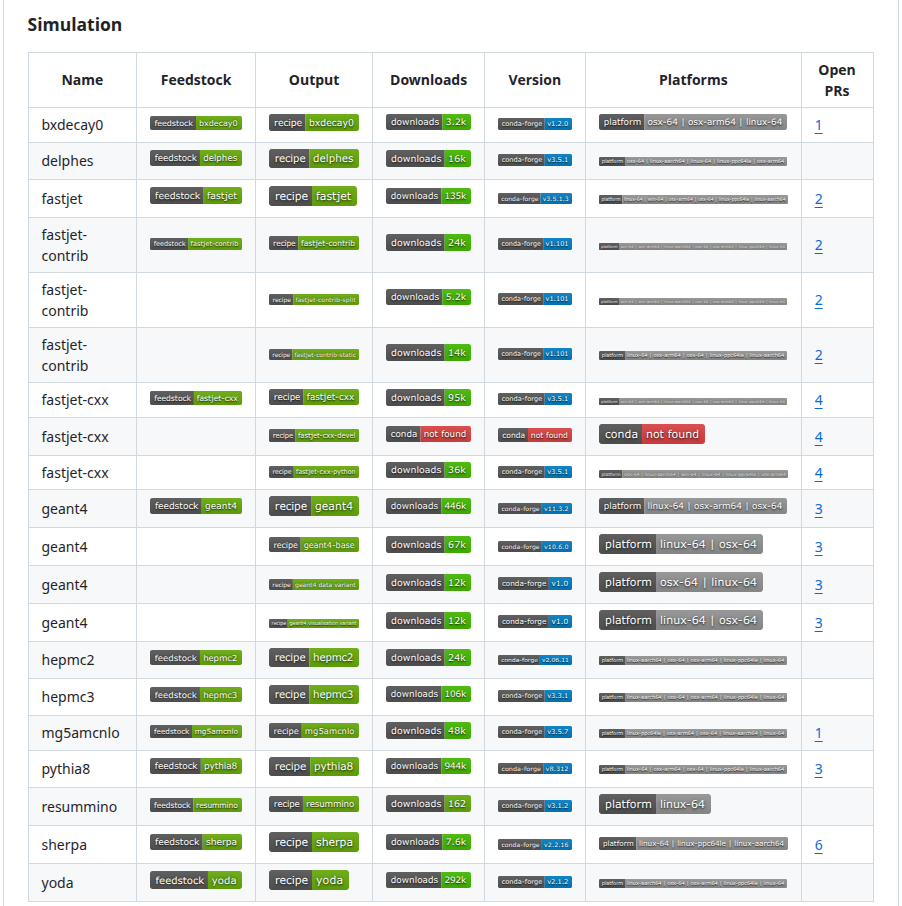
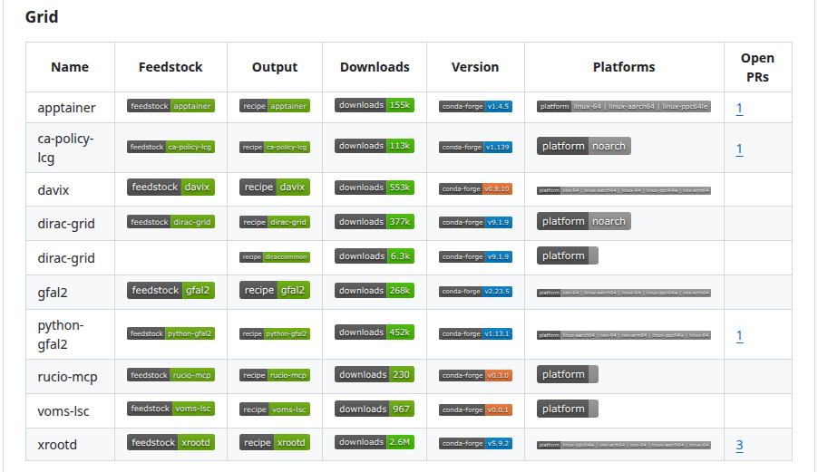
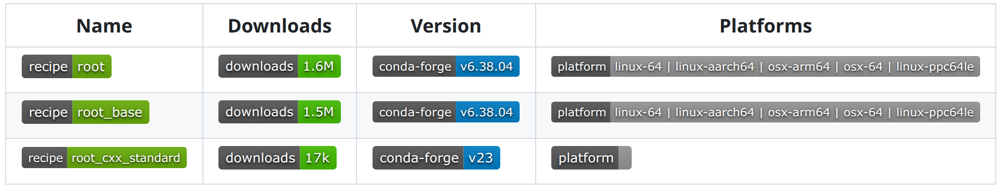
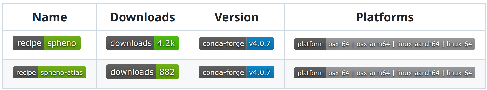

class: middle, center, title-slide
count: false

# HEP Packaging Coordination: Distributing the HEP software ecosystem on conda-forge

.huge.blue[Matthew Feickert], .huge[Chris Burr, Lindsey Gray, Giordon Stark] 
.huge[(University of Wisconsin&ndash;Madison)]

.large[
[CHEP 2026](https://indico.cern.ch/event/1471803/contributions/6966833/) 
[Track 6 &ndash; Software environment and maintainability: Ecosystems, Collaboration, and Workflows](https://indico.cern.ch/event/1471803/sessions/624975/#20260525) 
May 27th, 2026
]

<!--
# Abstract

The packaging of high energy physics software with robust, yet flexible, distribution methods is a complicated problem that has been met with multiple approaches by the community. The [HEP Packaging Coordination](https://github.com/hep-packaging-coordination) community project expands packaging of the HEP software ecosystem through building and distributing language-agnostic conda packages on the conda-forge package index. Through use of the conda-forge community build cyberinfrastructure, computing platform specific optimized builds of packages can be created for selections of Linux, macOS, and Windows across x86-64, AArch64/ARM64, and ppc64le architectures. In addition to supporting [builds of ROOT](https://github.com/conda-forge/root-feedstock), this work provides multi-platform packaging of a wide array of [low-level-language phenomenology tools](https://github.com/conda-forge/collier-feedstock), the [broader simulation stack](https://github.com/conda-forge/pythia8-feedstock), [end-user-analysis tools](https://github.com/conda-forge/awkward-feedstock) and [statistical frameworks](https://github.com/conda-forge/cms-combine-feedstock), and the [reinterpretation ecosystem](https://github.com/conda-forge/rivet-feedstock). Ongoing work is also supporting builds of LHCb experiment software and distributions of community software with experiment-specific patches applied for use in LHC physics analyses.

This process significantly lowers technical barriers across tool development by providing automatic packaging systems with source code, distribution through secure and transparent build cyberinfrastructure, and enables use through multi-platform optimized binary builds. When combined with next generation scientific package management and manifest tools, the creation of fully specified, portable, and trivially reproducible multi-language software environments becomes easy and fast, even with the use of development platforms for hardware accelerators (e.g. CUDA on NVIDIA GPUs). This talk provides an overview of the work, gives practical recommendations for adoption and best practices for both software maintainers and end-user analysts, and demonstrates examples of new distribution methods that are complementary to existing community technologies, such as [CernVM-FS](https://cernvm.cern.ch/fs/).
-->

<!--
# Notes

* https://indico.cern.ch/event/1471803/contributions/6966833/
* 18 minutes
   - 15 talk
   - 3 questions
* Each presentation slot is 18 minutes, including up to 15 minutes for the talk, with the remaining time reserved for questions and discussion.
* Presenters are required to prepare slides in PDF format with a 16:9 aspect ratio. While PowerPoint files may be used, we cannot guarantee full compatibility (e.g., missing fonts or formatting issues).
* Slides must be uploaded to Indico by the end of the morning plenary session on the day of your presentation.
* We strongly recommend that presenters bring a backup copy of their slides (e.g., on a laptop or USB drive), in case of any technical issues with Indico (unlikely, it might happen).
-->

---
# HEP Packaging Coordination collaborators

  

   <figure>
      
   .center[[Matthew Feickert](https://www.matthewfeickert.com/)
   UW&ndash;Madison 
   (ATLAS, IRIS-HEP)]
   </figure>
   <figure>
      
   .center[[Chris Burr](https://github.com/chrisburr)
   CERN 
   (LHCb, conda-forge core)]
   </figure>
   <figure>
      
   .center[[Lindsey Gray](https://cms.fnal.gov/lindsey-gray/)
   Fermilab 
   (CMS)]
   </figure>
   <figure>
      
   .center[[Giordon Stark](https://giordonstark.com/)
   UC Santa Cruz 
   (ATLAS, IRIS-HEP)]
   </figure>

---
# Quick setup for examples

.center.huge[This talk has runnable examples 

To follow along, install [Pixi](https://pixi.prefix.dev/) and then restart your shell
]

.smaller[
* Linux / macOS

.center[
<pre class="file-tree">
curl -fsSL https://pixi.sh/install.sh | bash
</pre>
]

* CVMFS (thanks to [Clemens Lange](https://clemenslange.de/))

.center[
<pre class="file-tree">
. /cvmfs/cms-griddata.cern.ch/cat/sw/pixi/latest/setup.sh
</pre>
]

* Linux container

.center[
<pre class="file-tree">
docker run --rm -ti ghcr.io/prefix-dev/pixi:latest
</pre>
]
]

.center[
Pixi is a .bold[fast, modern, and reproducible] software environment management tool for conda and Python packages
<!-- Pixi is a single securely signed Rust binary, it won’t hurt you, and you can trivially remove it from your computer later if you want. -->
]

---
# Due for a packaging update talk at CHEP

   

.center.large[[Chris Burr, CHEP 2019](https://indico.cern.ch/event/773049/contributions/3473243/)]

---
# Reducing barriers from thought to plot

   
   
   
   
.center[[Simone Campana, CHEP 2026](https://indico.cern.ch/event/1471803/contributions/6892513/)]

* Simone's plenary highlighted .bold[opportunities] for the software community to .bold[leverage new/better software]
* Portability, Interoperability, Commonality benefits .bold[apply to software packaging] as well

---
# Heterogeneous approach to software distribution

.huge.center[
In HEP currently have multiple forms of software distribution 
(different solutions for different kinds of software)
]

.large[
* Source distribution (Git repository, [Spack](https://spack.io/))
* Operating system specific distributions (`.rpm`, `.deb`)
* Nix packages
* Python packages (sdists and wheels on PyPI, private indexes)
* Conda packages
* Linux container images (Docker, Apptainer)
* [CernVM-FS](https://cernvm.cern.ch/fs/) (globally distributed, immutable, not extensible to end-user)
]

.center[
.huge[Approach "works" but introduces .bold[conflicts] and .bold[friction]]
 
.large[(What package type should be used? Will these be compatible? Do the same versions exist?)]
]

---
# End-user wants

.large[
* To be able to create .bold[bespoke software environments] to address their problems without effort or time
   - Minimize the time from idea to implementation
   - Declarative specification of software requirements
* .bold[One tool/system] across all computing systems
   - Software environment workflow on local machine and cluster are same/similar
   - One tool, not $n$ tools
* Multi-platform
   - Solutions exist for Linux `x86_64` and `aarch64`
   - Developing on macOS `arm64` .bold[shouldn't be a barrier to using physics tools]
* Scientific software environment reproducibility
   - .bold[Reproducible by default], not pain and expertise
]

---
# What is a [onda package](https://prefix.dev/blog/what-is-a-conda-package)?

.kol-3-5[
.large[
* Fundamentally, `zip` compressed archive (`.conda`) containing `.tar.zst` with:
   - JSON metadata (`conda-meta/`) describing package, provenance, requirements, and dependencies
   - .bold[relocatable] files, platform-specific .bold[binaries], symlinks
* Simple yet .bold[general and powerful]
   - Effectively .bold[any] software can be packaged as a conda package
      - Including microarchitecture optimisied software, CUDA libraries
]
<!--  -->

   
.center["Paxton" the conda package (prefix.dev GmbH)]

<!--  -->
]
.kol-2-5[
<pre class="file-tree">
.pixi/
└── envs
    └── default
        ├── bin
        ├── conda-meta
        ├── include
        ├── lib
        ├── man
        ├── share
        ├── ssl
        └── x86_64-conda-linux-gnu
</pre>
.left[Directory tree of an unpacked conda package]
 
.center[
<pre class="file-tree">
pixi global install pixi-browse
pixi browse -m root_base
</pre>
]
]

---
# What makes conda packages powerful?

<!-- TODO: Figure out the lead with awesome part -->
.large[
* .bold[Robust standards]: define all requirements down to the `glibc` level
   - Ensures/requires that all dependencies also exist as conda packages
   - No reliance on assumptions that things exist at the OS-level
* .bold[Language agnostic]: The .bold[recipe format] for building a C++, Python, Fortran, Rust, Go package is all the same
* .bold[Multi-platform binary builds] for the same release of a package
   - The conda recipe will be built for all computing platforms it is told to (e.g. `linux-64`, `linux-aarch64`, `osx-arm64`)
* "build variants" that allow for further .bold[refinement and optimization]
   - MPI build variants for MPICH and Open MPI
   - [microarch level](https://prefix.dev/blog/building_cpu_optimized_packages) for enabling Single Instruction, Multiple Data (SIMD)
* .bold[Rebuilds] of packages for the same version
   - Allow for continual updates against ABI changes of dependencies, builds against security patches
]

---
# conda-forge: community cyberinfrastructure

.kol-1-2[
.code-large[
* A "forge" for conda packages [orchestrated through GitHub](https://github.com/conda-forge/)
   - Provides .bold[global build infrastructure] and farm across cloud providers
      <!-- - You provide package recipe, conda-forge builds and distributes it -->
   - Driven through continuous integration actions on independent project "feedstock" GitHub repositories
      <!-- - Automatically updated through bots and feedstock automation tools -->
* Fiscally sponsored NumFOCUS project, financially supported by NVIDIA, in-kind .bold[support across industry]
* HEP connections and leadership
   - [Created](https://www.youtube.com/watch?v=U2oa_RLbTVA) at [SciPy 2015 conference](https://youtu.be/Hacl_YFzZOw?si=5i3LOR7ItZp7ZwIe) by .bold[Phil Elson] (UK Met Office, now at CERN accelerator division) and Filipe Fernandes (US NOAA)
   - .bold[Chris Burr] (CERN, LHCb) serves on conda-forge core / leadership team
]
]
.kol-1-2[

   

   <figure>
      
   </figure>
   <figure>
      
   </figure>

]

---
# conda-forge: community powered

.huge[
<!-- * Impressive global cyberinfrastructure and automation -->
* Community approach of .bold[building coherently together]
   - Over 32,000 packages with over 42 billion downloads and growing
   - Supports building and .bold[using] all packages built on conda-forge together without conflicts (boon over private channel)
   - Provides "[global pinning](https://github.com/conda-forge/conda-forge-pinning-feedstock)" infrastructure to .bold[automatically migrate ABI changes] across entire ecosystem
* Automate the boring stuff, focus on getting useful software
   - New releases of upstream source distribution of software (e.g. GitHub/GitLab, PyPI, HEPForge) automatically picked up by [`regro-cf-autotick-bot`](https://github.com/regro-cf-autotick-bot) to [generate update PR with rebuild](https://github.com/conda-forge/fastjet-cxx-feedstock/pull/21)
   - Immutable package artifacts published to https://anaconda.org/channels/conda-forge/
      - Old releases stay useable "forever", new releases automatically up to date
]

---
# HEP Packaging Coordination

<!-- * What / who is it?
* What does it provide?
* What benefits are there for contributing.
* What can it do today in terms of support. -->

.kol-1-2[
.large[
* [Community project on GitHub](https://github.com/hep-packaging-coordination) to get as much HEP software as possible on conda-forge
   - High quality research software should be trivial to install and provide platform specific optimized binary builds by default
   - Building from source should be an option for development and debugging, not the default
* Contributions from .bold[broader HEP ecosystem]: ATLAS, CMS, LHCb, LEGEND, IRIS-HEP, Scikit-HEP, ROOT Team, DIRAC, CEDAR, theory and pheno community
   - Working with Belle II and SHiP
* .bold[Over 120 HEP packages] added to  conda-forge
]
]
.kol-1-2[

   <figure style="--x: 0; --y: 0; --z: 1; --w: 70%;">
      
   </figure>
   <figure style="--x: 15%; --y: 18%; --z: 2; --w: 70%;">
      
   </figure>
   <figure style="--x: 30%; --y: 36%; --z: 3; --w: 70%;">
      
   </figure>

.center.bold[[github.com/hep-packaging-coordination](https://github.com/hep-packaging-coordination)]
]

---
# Case study: ROOT

.kol-2-3[
.large[
* Easiest way to get robust builds of ROOT on your platform
<!--  -->

   

* `root_base` is a direct dependency of .bold[over 40 packages] across conda-forge
* In 2026 ROOT Team has done a great job of working with the other feedstock maintainers to support the conda-forge community (big thanks to [Vincenzo Padulano](https://github.com/vepadulano/) for leading)
   - Reduction of patches required for build, reducing runtime compiler requirements, improved `root_base` as dependency support
   - conda-forge support continued top level priority in 2026  [ROOT Plan of Work](https://cern.ch/root-pow)
]
]
.kol-1-3[

   

<pre class="file-tree">
pixi global install root
pixi global expose add \
--environment root pyroot=python
</pre>

<!-- 

   

.center[[Vincenzo Padulano](https://github.com/vepadulano/)]

 -->
]

---
# Case study: FastJet

<!-- Other than that what's interesting is that it has really great usage statistics for the python bindings and the lower level interface. I think another important thing to point out is that moving properly to conda required that whole cmake adventure and make fastjet waaay more easy to manage as a package for experiments with the cmake integration. -->

.kol-2-3[
.large[
<!-- * FastJet is a foundational library for HEP hadronic workflows -->
* Creation of `fastjet-cxx` conda-forge package in collaboration with FastJet authors has allowed for .bold[better FastJet distribution] (motivated by CMS analyses)
   - Previously, building from source for particular configurations was realistically only approach for bespoke configurations
   - Distribution of FastJet Contrib
* C++ and Python bindings into separate feedstock "output" packages to distribute only what is needed
<!-- 11.7 MB to 1.4 MB for `fastjet-cxx` and  `fastjet-cxx-python` -->
* Through upstreaming improvements to FastJet's  build system .bold[[reduced the package size by  over 10 MB](https://github.com/conda-forge/fastjet-cxx-feedstock/pull/18#issuecomment-3025784849)]
   - Migrate SISCone, FJ, FJ Contrib from Autotools to CMake
   - build Python bindings [on top of existing `fastjet-cxx`](https://gitlab.com/fastjet/fastjet/-/merge_requests/26)
]
]
.kol-1-3[

   

<pre class="file-tree">
pixi init fastjet-example && cd fastjet-example
pixi add fastjet-contrib fastjet-cxx-python
pixi run python -c 'import fastjet_cxx as fj'
</pre>

]

---
# Case study: Pythonic analysis

.kol-2-3[
.code-large[
* conda-forge Python builds currently fastest/optimally-built Python pre-built binaries
   - conda-forge has optimizations throughout the entire toolchain
   - [`python-build-standalone`](https://github.com/astral-sh/python-build-standalone) (now maintained by [Astral](https://github.com/astral-sh)) can be [.italic[slightly] faster](https://conda-forge.zulipchat.com/#narrow/channel/457337-general/topic/Performance.20of.20builds.20from.20.60python-feedstock.60.20vs.20upstream/with/504989455) now
* In most cases, the conda-forge versions of Python packages and Python are .bold[faster than the Python package builds on PyPI]
   - .italic[Probable] reasons: conda-forge builds have newer compilers, not statically linking and vendoring
* Benchmarking the IRIS-HEP CMS Analysis Grand Challenge (AGC) has shown .bold[faster analysis throughput with full conda-forge ecosystem environments]
   - Bigger impact comes from using .bold[newer Python versions]. With conda packaged Python updating is trivial.
   - Credit: [Peter Fackeldey](https://github.com/pfackeldey), [Iason Krommydas](https://github.com/ikrommyd)
]
]
.kol-1-3[

   

   

]

---
# Bespoke environments distributed with CVMFS

.code-large[
* Through use of [Pixi](https://pixi.prefix.dev/), can trivially create multi-platform software environments .bold[locked to the digest level]
   - Byte-level reproduction indefinitely far into the future (as long as the conda channel exists)
* Deployment of bespoke software environments would ideally also be possible without use of Pixi itself (or [`pixi-pack`](https://github.com/Quantco/pixi-pack)): .bold[CVMFS is a natural fit]
* LHCb has already been doing this with [`lbcondawrappers`](https://github.com/conda-forge/lbcondawrappers-feedstock) (provides `lb-conda`) to [distribute locked environments](https://gitlab.cern.ch/lhcb-core/conda-environments)
]
<!--  -->
.center[
<pre class="file-tree">
# ssh &lt;cvmfs connected cluster&gt;
$ pixi global install lbcondawrappers
$ lb-conda experimental/scikit-hep  # activates new subshell with locked environment
$ python -c 'import awkward; print(awkward)'
&lt;module 'awkward' from '/cvmfs/lhcbdev.cern.ch/conda/envs/experimental/scikit-hep/.../awkward/__init__.py'&gt;
</pre>
]
<!--  -->
.code-large[
* Ongoing work to generalize and broaden support
   - c.f. [.bold[Chris Burr's plenary talk]](https://indico.cern.ch/event/1471803/contributions/6970826/)! (Thursday 2026-05-28)
]

---
# Practical use cases

.larger[
* Distributing IRIS-HEP Analysis Systems ecosystem for Analysis Facilities
]

.center[
<pre class="file-tree">
# ssh login.af.uchicago.edu
$ pixi global install lbcondawrappers
$ lb-conda experimental/iris-hep  # activates new subshell with locked environment
$ python -c 'import hist; print(hist)'
&lt;module 'hist' from '/cvmfs/lhcbdev.cern.ch/conda/envs/experimental/iris-hep/.../hist/__init__.py'&gt;
</pre>
]

.larger[
* [Experiment specific patched](https://github.com/conda-forge/spheno-feedstock/blob/391703127dceeae5399f9ae6429eb4d91e51a027/recipe/recipe.yaml#L20-L23) package variants from same feedstock
]

.center[
<pre class="file-tree">
pixi init build-variants && cd build-variants
pixi add spheno-atlas  # build variant of spheno
</pre>
<!--  -->

   

]

---
# Practical use cases

.larger[
* Hardware accelerated environments for AI/ML and CUDA accelerated simulation (leveraging full CUDA-stack on conda-forge)
]

.center[
<pre class="file-tree">
$ pixi init cuda-example && cd cuda-example
$ pixi workspace system-requirements add cuda 12
$ time pixi add --platform linux-64 --no-install cuda-compiler geant4 pytorch-gpu
...
real	0m3.097s  # warm repodata cache
</pre>
]

.larger[
* AI/ML assistive tooling (e.g. MCP servers) distribution that your agent can execute
]

.center[
<pre class="file-tree">
pixi exec --spec rucio-mcp sh -c 'rucio-mcp init atlas'  # only needed once
pixi exec --spec rucio-mcp sh -c '$X509_CERT_DIR/refresh_crls.sh'  # only needed once
pixi exec --spec rucio-mcp sh -c 'voms-proxy-init -voms atlas'
pixi exec --spec rucio-mcp sh -c 'RUCIO_ACCOUNT=&lt;your username&gt; rucio-mcp ping'
</pre>
]

---
# (Known) Limitations / Future work

.huge[
* Entire environment needs to be provided
   - .bold[Normally a feature], but you can imagine situations in which you want to .bold[extend] an existing experiment specific environment (e.g. LCG view) that is hardcoded to certain binaries (e.g. Python).
   - Chris Burr leading work on `rattler-fs` to allow for overlays on top of existing environments
* Environment robustness and stability means more files, can be problematic at HPC systems
   - .bold[Normally a feature]: conda environments are more complete forms of environments/distributions and provide all the required files down to `glibc`. They install more files and so the filesystem has to perform more file operations, which can be taxing at HPC facilities.
   - Workaround: [Trivially containerize](https://doi.org/10.25080/nwuf8465) the locked environment and use Apptainer
]

---
# Summary

.larger[
* .bold[Conda packages] combined with the .bold[conda-forge ecosystem] offer the HEP community a way to address .bold[multi-platform, multi-language] software environment management of HEP tools
* .bold[Call to action]: If you maintain software for HEP, consider distribution on conda-forge
   - Distribute high quality builds, ABI migrations, optimizations across toolchains
* .bold[Opportunity] for HEP to contribute to broader ecosystem and benefit
   - Everyone gets optimized binaries built by experts, experts maintain less build software and infrastructure
]

   <figure>
      
   </figure>
   <figure>
      
   </figure>
   <figure>
      
   </figure>

---
# Acknowledgements

.huge[This work was supported by the United States National Science Foundation under Cooperative Agreement [PHY-2323298](https://nsf.gov/awardsearch/showAward?AWD_ID=2323298) (Institute for Research and Innovation in Software for High Energy Physics (IRIS-HEP)).]

   

---
class: end-slide, center

.large[Backup]

---
# What do I (tool developer) need to do?

.huge[
* Can you .bold[write a build script] and .bold[install] your project?
   - ~90% of the the way to having your software be packaged on conda-forge.
* Have all your .bold[dependencies on conda-forge] already (bootstrap system)
   - Might have to talk to your colleagues (or package them yourself)
*  Have your .bold[source code] exist from a .bold[stable and static official source]
   - No go🛑: Distributions on website that may disappear without warning / no long term archive
   <!-- - Not great: Tarballs on a distribution website with no long term preservation -->
   - Good✅: Public version controlled system with release tags / source on package index
* .bold[Ask for help] from people in HEP Packaging Coordination
]

---
# What do I (tool user) need to do?

.center.bold.huge[Very little! ✨]

.huge[
* Know what your .bold[software requirements] are
* Know what .bold[computing platforms] you want your analysis to run on
* Have .bold[Pixi installed] (lives in user space so you can do this yourself anywhere)
      - Or use the CVMFS distribution
]
.center[
<pre class="file-tree">
. /cvmfs/cms-griddata.cern.ch/cat/sw/pixi/latest/setup.sh
</pre>
]
.huge[
* Declaratively describe your environment needs with Pixi
]

---
# How do you create a conda package?

.huge[
* Create a .bold[recipe] in the form of a .bold[structured YAML file] (`recipe/recipe.yaml`) with a recipe build tool ([`rattler-build`](https://rattler-build.prefix.dev/))
* From the [`conda-forge/staged-recipes`](https://github.com/conda-forge/staged-recipes) repository, can create Python recipes automatically using [`grayskull`](https://github.com/conda/grayskull/) with
.center[
<pre class="file-tree">
pixi run pypi &lt;package name&gt;
</pre>
]
* [Searching conda-forge itself](https://github.com/search?q=org%3Aconda-forge%20path%3Arecipe%2Frecipe.yaml&type=code) is an excellent resource
]

---
# conda packages and Linux containers

.center.huge[
Different solutions for different problems: 
.bold[Linux containers are distribution methods, not packaging technologies]
]

.huge[
Linux containers for when you want to:

* Deploy an instantiated, bespoke environment as a single executable on a .bold[known platform]
* Sandbox an environment from the rest of the operating system

Containerization .bold[should be trivial install of existing locked environment]
.center[DOI: [10.25080/nwuf8465](https://doi.org/10.25080/nwuf8465)]
]

---

class: end-slide, center
count: false

The end.
